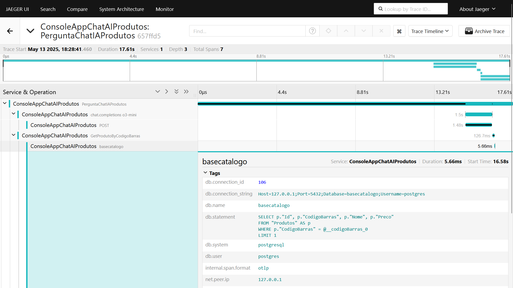

# dotnet9-semantickernel-postgres-otel-jaeger_consultaprodutos
Exemplo em .NET 9 de Console Application que faz uso do projeto Semantic Kernel, com integração com soluções de IA como Azure Open AI e Ollama na consulta de informações de produtos em uma base PostgreSQL. Inclui Docker Compose para criação do ambiente de testes com os dados + monitoramento com Jaeger e OpenTelemetry.

---

## Resultados da Telemetria

Exemplo de trace, destacando a consulta à base de dados:

Detalhamento exibindo o consumo de tokens (em testes com o Azure OpenAI):

